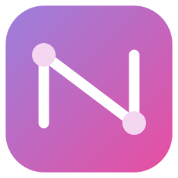
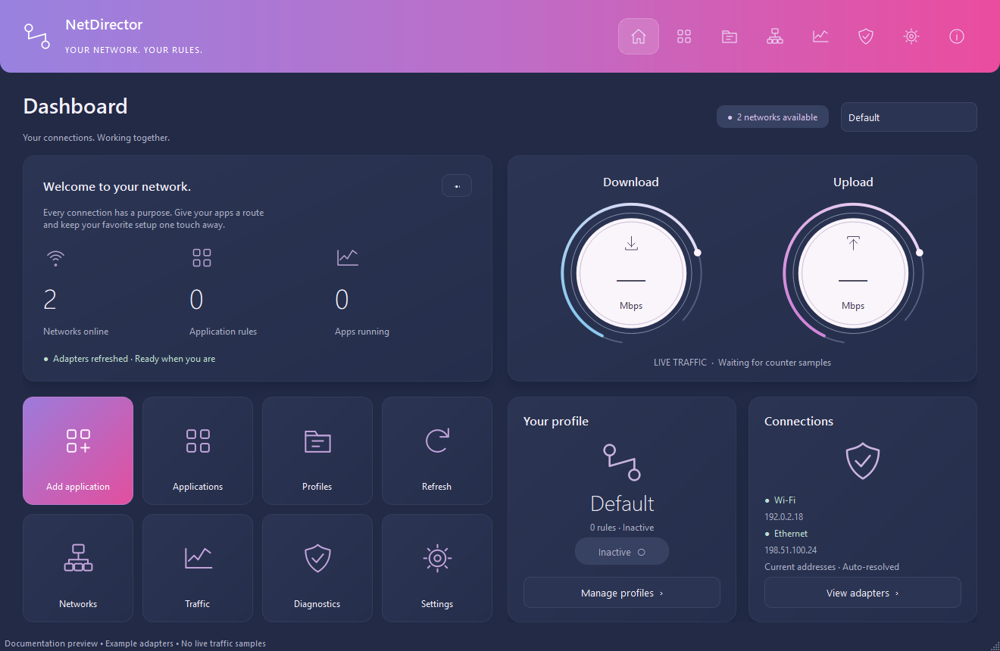
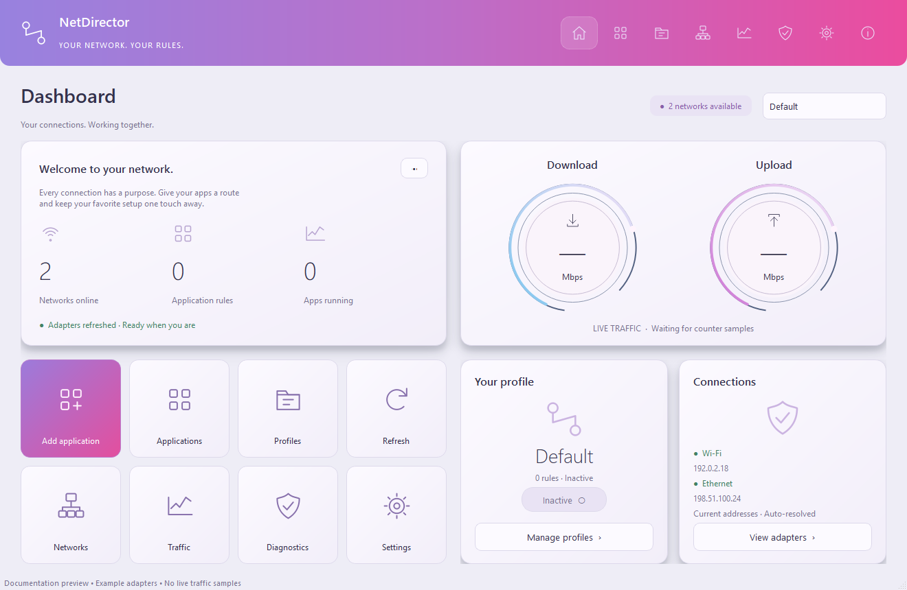

<div align="center">
  
  <h1>NetDirector</h1>
  <p><strong>Your network. Your rules.</strong></p>
  <p>A Windows desktop app for choosing which network your applications use.</p>
</div>


Save a setup such as **Steam → Wi-Fi**, **Discord → Ethernet**, and **another app → Windows default**. Switch profiles, launch applications, and inspect their connections from one dashboard.

**Profiles remember the adapter—not its temporary IP address.** NetDirector discovers adapters before startup activation and resolves the current address again before every launch.



*Documentation preview with example adapter addresses. The installed app displays your detected networks and measured traffic.*

## Download

Open [GitHub Releases](../../releases/latest) and download the installer or ZIP matching your Windows installation:

| Package | Use it for | Details |
|---|---|---|
| `NetDirector-VERSION-windows-x64-Setup.exe` | **Recommended:** 64-bit Windows 10 / 11 | Windows setup installer (includes ForceBindIP) |
| `NetDirector-VERSION-windows-x64.zip` | Portable 64-bit Windows | Standalone folder (includes ForceBindIP) |
| `NetDirector-VERSION-windows-x86-Setup.exe` | Legacy 32-bit Windows | Windows setup installer (includes ForceBindIP) |
| `NetDirector-VERSION-windows-x86.zip` | Portable legacy 32-bit Windows | Standalone folder (includes ForceBindIP) |

### Installation:
- **Installer (Recommended):** Run the `*-Setup.exe` wizard. It installs NetDirector, creates desktop/start menu shortcuts, and installs ForceBindIP so adapter routing works out of the box.
- **Portable ZIP:** Extract the entire ZIP into a folder and run **NetDirector.exe** (keep `_internal` and `ForceBindIP` beside it).

Python and ForceBindIP binaries are included. Builds are unsigned. Each release provides SHA256 checksums; verify a download with `Get-FileHash .\NetDirector-*-windows-x64-Setup.exe -Algorithm SHA256`.

**Architecture matters:** x86 refers to the NetDirector application itself, not the applications it can launch. The x64 package already selects the correct ForceBindIP loader for both x86 and x64 targets. PySide6 has [no 32-bit Windows distribution](https://wiki.qt.io/PySide), so the x86 package uses a legacy Qt 5 compatibility layer. Prefer x64 whenever possible; the x86 package relies on older runtime components and does not promise Windows 7 support.

## Features

- **Application rules:** browse or drag in `.exe` files, choose adapters, arguments, working directories, and fallback behavior.
- **Profiles:** create, duplicate, import/export, activate, and select a startup profile.
- **Dynamic discovery:** adapter GUID/MAC matching survives renames and DHCP address changes without reusing a saved IP.
- **Safe fallback choices:** block launch, use Windows default, ask, or wait for the adapter.
- **Dashboard:** live adapter traffic, available connections, profile controls, and action tiles.
- **Diagnostics:** observe application/child processes and their socket-local addresses; flag addresses that differ from the launch IP.
- **Windows integration:** system tray, optional start with Windows, launch minimized, and light/dark/system appearance.
- **Local storage:** JSON configuration and rotating logs; no telemetry. No global routes, DNS, metrics, gateways, or firewall rules are changed.

<details>
<summary>Light theme</summary>



</details>

## How routing works

```text
Saved adapter identity
        ↓
Discover current Windows adapters
        ↓
Match the intended adapter and resolve its current IP
        ↓
Launch through the configured binding backend
```

ForceBindIP is a **launch-time** backend. Close an existing instance before launching it through NetDirector. Activating a profile launches only enabled rules with automatic launch selected. Pausing cancels queued launches; it does not change already-running processes.

### Important limitations

- A successful launch is **not proof** that all traffic is bound. Use Diagnostics to inspect observable connections.
- Child processes are monitored; inherited binding is **not guaranteed**. Steam helpers, launchers, anti-cheat software, and modern Chrome may not work with this backend.
- IPv6 enforcement, DNS routing, and VPN leak prevention are not provided. This is not a traffic-isolation or VPN-security tool.
- Exact per-process bandwidth is unavailable. Dashboard traffic comes from actual adapter counters; virtual and physical interfaces may count the same traffic.
- BindIP and native engines are explicit, unimplemented extension points. ForceBindIP is the implemented adapter-binding backend.
- Actual ForceBindIP interception requires separate end-to-end verification with your target application. CI verifies code, packaging, executable architecture, and adapter discovery—not arbitrary third-party application compatibility.

See the [user guide](docs/USER_GUIDE.md) for profiles, ForceBindIP setup, troubleshooting, diagnostics, and data recovery.

## Run from source

### x64 — recommended

Install **Python 3.12 x64**, then open PowerShell in the repository root:

```powershell
py -3.12-64 -m venv .venv
.\.venv\Scripts\Activate.ps1
python -m pip install -r requirements-x64.txt -r requirements-build.txt
python scripts/create_assets.py
python main.py
```

### x86 — legacy compatibility

Install **Python 3.10 x86** and use its interpreter explicitly:

```powershell
py -3.10-32 -m venv .venv-x86
.\.venv-x86\Scripts\Activate.ps1
python -m pip install --only-binary=:all: -r requirements-x86.txt -r requirements-build.txt
python scripts/create_assets.py
python main.py
```

The runtime is selected from the Python process bitness. A 32-bit process on 64-bit Windows uses native PowerShell through `Sysnative` for adapter discovery.

## Tests and local builds

From the matching activated environment:

```powershell
python -m pytest -q

# Choose the architecture matching the active Python interpreter:
.\scripts\build.ps1 -Architecture x64
.\scripts\smoke_package.ps1 -Executable dist/x64/NetDirector/NetDirector.exe
python scripts/package_release.py --architecture x64
```

Replace `x64` with `x86` for the legacy build. The build checks interpreter architecture, runs tests, generates icons/version metadata, and creates a folder-based executable under `dist/<architecture>/NetDirector/`. ZIPs and checksums appear under `release/`. An optional `-OneFile` local build is available; automated releases use the folder package.

The build script isolates PATH to avoid bundling incompatible DLLs from unrelated software. Always use it rather than invoking an old generated `.spec` file. Release packages include dependency versions, project and third-party notices, and installed dependency license files.

## GitHub Actions releases

[The Windows workflow](.github/workflows/release.yml) runs on pull requests, pushes to `main`/`master`, version tags, and manual dispatches.

- Builds and tests **x86 and x64** on separate Windows jobs.
- Smoke-tests each executable and verifies the PE architecture before packaging.
- Uploads ZIPs and SHA256 files as workflow artifacts.
- Publishes a GitHub Release **only for a `v*` tag**, after both builds succeed. Branch and PR runs never publish a release.
- Requires no personal access token; the release job uses GitHub's scoped `GITHUB_TOKEN`.

To publish version `1.1.0`, ensure `VERSION` contains `1.1.0`, commit your changes, and push:

```powershell
git tag v1.1.0
git push origin v1.1.0
```

The workflow fails if the tag disagrees with `VERSION`. For subsequent releases, edit `VERSION` and use a new matching tag. See [repository setup and releases](docs/RELEASING.md) for first-time publishing instructions.

## Configuration

User data is stored in `%LOCALAPPDATA%\NetDirector`:

Existing installations retain their previous data folder so saved profiles and settings remain available after the rename. `NETDIRECTOR_DATA_DIR` is the current override; the previous environment-variable name is also accepted for compatibility.

```text
settings.json
profiles/<profile-id>.json
logs/netdirector.log
```

Set `NETDIRECTOR_DATA_DIR` for isolated testing or portable data. Keep that directory out of Git. Imported profiles have automatic startup/launch disabled until reviewed. `.gitignore` excludes build outputs, local data, logs, credentials, and live screenshots; public documentation screenshots use example addresses.

## Contributing and license

Issues and pull requests are welcome. Read [CONTRIBUTING.md](CONTRIBUTING.md), keep routing logic separate from the UI, and test both runtimes when changing Qt code.

NetDirector's own code is available under the [MIT License](LICENSE). Dependencies retain their own licenses; see [third-party notices](THIRD_PARTY_NOTICES.md). ForceBindIP is not bundled.
